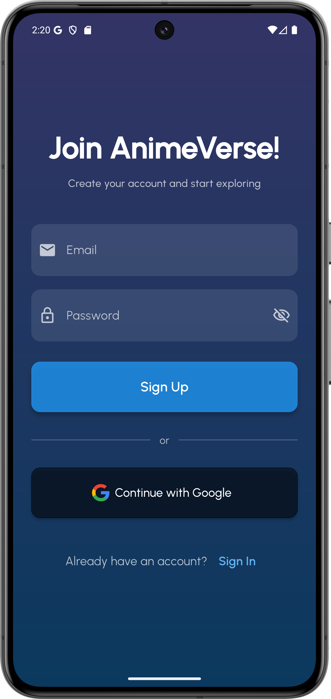
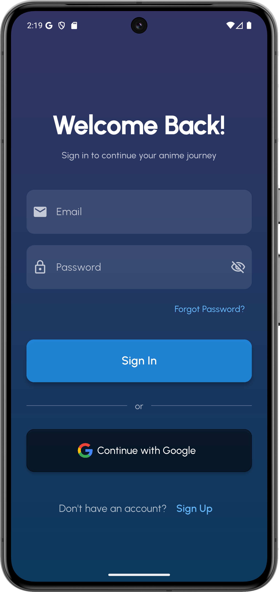
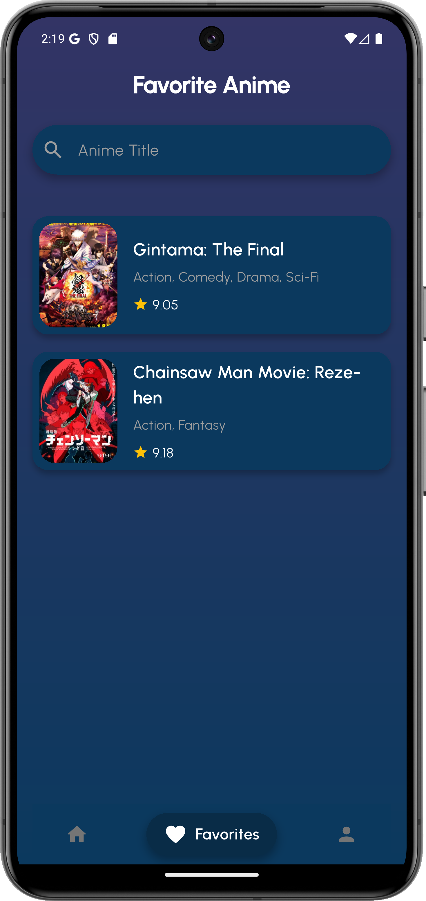
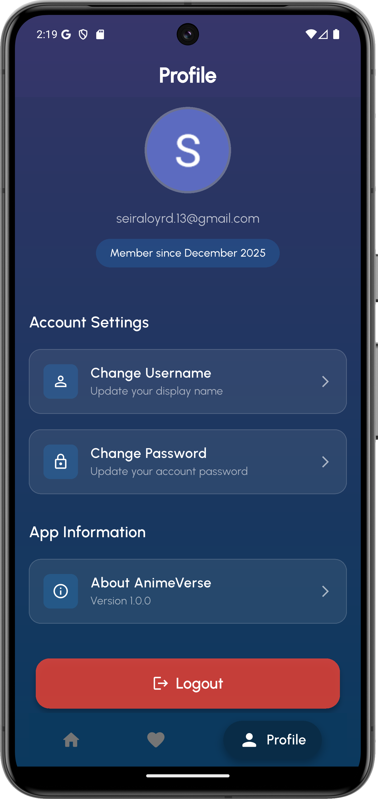

# 🎬 Anime Verse

**Your Personal Anime Companion**  
*Discover, Track, and Explore Your Favorite Anime in One Place*

[📥 Download](https://github.com/clrsahlim/anime_verse_clarissa/releases)

---

## 👤 Personal Identity

| **Name**       | **NIM**   | **Lab** |
|----------------|-----------|---------|
| Clarissa Halim | 231401020 | 3       |

**Universitas Sumatera Utara**  
**Mata Kuliah:** Pemrograman Mobile  
**Asisten Lab:** Rivaldo Dominggos Pardede

---

## ✨ What is Anime Verse?

**Anime Verse** is a modern mobile application built with Flutter that allows anime enthusiasts to discover, track, and manage their favorite anime series. With seamless Firebase integration, enjoy a personalized anime tracking experience with real-time synchronization across devices.

Think of it as your **personal anime library** in your pocket—always accessible, beautifully designed, and packed with features.

---

## 📱 Screenshots

  
  
  
  
  
  

*Browse anime, view details, manage your favorite list, and customize your profile—all with a beautiful interface.*

---

## 🎥 Demo Aplikasi

 

🔗 https://drive.google.com/file/d/1vzjbKebgQqDQ6_SCsts5qDY_yO_clsMW/view?usp=drive_link

---

## 📥 Installation

### **Download from GitHub Releases**

1. **Visit** the [Releases page](https://github.com/clrsahlim/anime_verse_clarissa/releases)

2. **Download** the latest APK:
    - `app-release.apk` (recommended)

3. **Enable Unknown Sources** (if first time installing APK):
    - Go to **Settings** → **Security**
    - Enable **Install from Unknown Sources**
    - Or on Android 8+: Allow installation from browser

4. **Install** the APK:
    - Open the downloaded file
    - Tap **Install**
    - Wait for installation to complete

5. **Launch** Anime Verse:
    - Tap **Open** after installation
    - Or find the app icon in your app drawer

6. **Done!** Start exploring anime 🎉

> 💡 **Note**: All releases are hosted on [GitHub Releases](https://github.com/clrsahlim/anime_verse_clarissa/releases). Always download from official sources to ensure security.

---

## 🎯 Quick Start Guide

### **First Launch**
1. After installation, open the **Anime Verse** app
2. **Create an account** or **Login** with existing credentials
3. Grant necessary permissions when prompted
4. Start browsing anime collections!

### **Common Tasks**

#### 🔍 **Browse Anime**
1. Open the app and navigate to **Home** tab
2. Scroll through featured and popular anime
3. Use the **Search** icon to find specific titles
4. Apply **Genre Filters** to narrow down results

#### 📚 **Add to Your Favorites**
1. Find an anime you like
2. Tap on the anime card to view details
3. Tap the **Favorite** button
4. Your favorite anime pick listed automatically to the cloud

#### 👤 **Manage Profile**
1. Navigate to **Profile** tab
3. Update your display name, avatar, or change your password
4. Save changes

---

## 🏗️ Tech Stack

| Category | Technology |
|----------|-----------|
| **Framework** | Flutter 3.35.3 |
| **Language** | Dart 3.9.2 |
| **Backend** | Firebase (Firestore, Auth, Storage) |
| **Architecture** | Clean Architecture |
| **Build Tools** | Gradle, Android SDK |
| **CI/CD** | GitHub Actions |

---

## 🙏 Acknowledgments

- **Bang Paldo** - For the guidance and mentorship throughout the semester
- **Lab 3 Classmates** - For continuous support and collaboration
- **IKLC Team** - For providing excellent learning materials and comprehensive teaching modules
  
---

## 📞 Contact & Links

---

_Bringing anime lovers together, one app at a time_

⭐ **Star this repo** if you find it useful!

